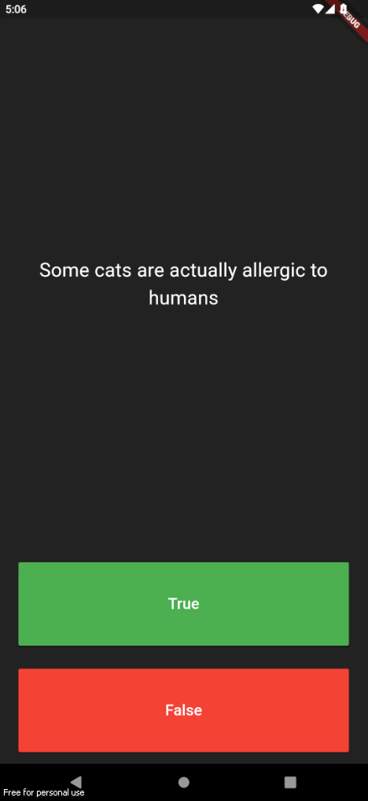

# flutter_qulizzler_app

A simple app the displays questions and user have to answer if it is true or false.

## Getting Started

Package used: rflutter_alert 2.0.7

- [Package link](https://pub.dev/packages/rflutter_alert)

- 

For help getting started with Flutter development, view the
[online documentation](https://docs.flutter.dev/), which offers tutorials,
samples, guidance on mobile development, and a full API reference.
